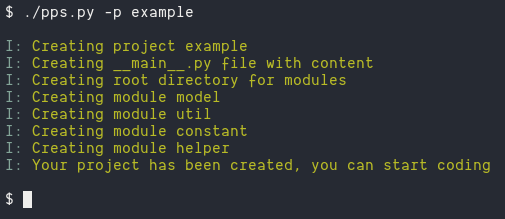
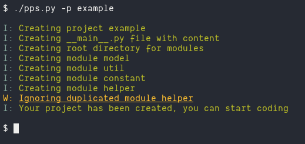

# Python Project Structure

This is a tool I use to create a base structure for my python project

# Installation
Download the repo and move the file `pps.py` in your local `bin` or in `/usr/bin/`

```bash
cp pps.py ~/.local/bin/pps
chmod +x ~/.local/bin/pps
```

```bash
sudo cp pps.py /usr/bin/pps
sudo chmod +x /usr/bin/pps
```

# Usage
just run the script with the `-p` argument providing a `project name`

```bash
pps -p example_project
```

# Arguments

```
-p/--profile -> The project name to create
```

# The result
if the project is created succesfully you will have a structure like this one

> running `pps -p example`


# Some outputs

## Project created



## Duplicated Module



## Duplicated Sub Module


## Project exists


## TODO

- [ ] Add argument to load a different configuration if passed